# APIBrasil MCP Client



  

Base de conhecimento, configurações e guias para consumir o servidor **MCP** da APIBrasil em **clientes de IA**, **IDEs**, **chatbots** e **ferramentas de automação**.

> **Nota:** A [APIBrasil](https://apibrasil.io) é um Gateway de APIs unificado para dados nacionais (CEP, CNPJ, Veículos, etc). Este repositório foca na integração dessas APIs via **Protocolo MCP** para Agentes de Inteligência Artificial.

---

## Decisão Rápida (TL;DR)

Escolha o método de conexão baseado na natureza da sua plataforma:

| Característica | Protocolo MCP  | API REST  |
| :--- | :--- | :--- |
| **Protocolo** | SSE (Server-Sent Events) | HTTP Standard |
| **Estado** | **Stateful** (Sessão Persistente) | **Stateless** (Request/Response) |
| **Uso Ideal** | Cursor, Claude, Agentes de IA | n8n, Typebot, Zapier, Webhooks |
| **Vantagem** | Contexto contínuo para LLMs | Simplicidade e compatibilidade universal |

## Endpoints

> Utilize estes endereços para configurar seus clientes.

| Serviço | URL | Status |
| :--- | :--- | :--- |
| **MCP Server** | `https://mcp.apibrasil.cloud/mcp` |  |
| **API Gateway** | `https://gateway.apibrasil.io/api/v2` |  |
| **Docs** | [doc.apibrasil.io](https://doc.apibrasil.io) |  |

## Comece por aqui

Selecione o seu caso de uso para ir direto à documentação específica:

| Objetivo | Diretório | Descrição |
| :--- | :--- | :--- |
| **Conectar IA** | [`clientes-ai/`](./clientes-ai/) | Claude Desktop, LibreChat, Lovable |
| **Configurar IDE** | [`ide-editores/`](./ide-editores/) | VS Code, Cursor, Zed, JetBrains |
| **Criar Chatbot** | [`chatbots-ai/`](./chatbots-ai/) | Typebot, Flowise, LangFlow, Dify |
| **Automação** | [`lowcode-automacao/`](./lowcode-automacao/) | n8n, Make, Zapier, Bubble |
| **Programar** | [`programacao/`](./programacao/) | Python, Node.js, Go, Java, C# |

## Configurações Rápidas (Snippets)

Copie e cole as configurações abaixo diretamente no seu arquivo de preferência.

### JSON Configs
- **Claude Desktop**: [`claude_desktop_config.json`](./clientes-ai/claude_desktop_config.json)
- **VS Code**: [`settings.json`](./ide-editores/vscode/settings.json)
- **Zed Editor**: [`settings.json`](./ide-editores/zed/settings.json)

### CLI Bridge (Ponte Local)
Para conectar via terminal ou adaptadores que aceitam comandos `stdio`:

```bash
npx -y @modelcontextprotocol/server-sse-client --url https://mcp.apibrasil.cloud/mcp
```

### Exemplo REST (PowerShell)
Para testes rápidos de conectividade sem depender do protocolo MCP:

```powershell
$headers = @{
  Authorization = "Bearer SEU_BEARER_TOKEN"
  DeviceToken   = "SEU_DEVICE_TOKEN"
}

$body = @{ cep = "01001000" } | ConvertTo-Json

Invoke-RestMethod -Method Post `
  -Uri "https://gateway.apibrasil.io/api/v2/cep/cep" `
  -Headers $headers `
  -ContentType "application/json" `
  -Body $body
```

> [!IMPORTANT]
> **Segurança e Estado**
> 
> *   **Stateful:** O MCP mantém uma sessão ativa (`sessionId`) via SSE. Não tente usá-lo em ambientes que matam a conexão imediatamente (como Serverless Functions puras sem stream).
> *   **Tokens:** Jamais comite seus tokens reais no repositório. Utilize variáveis de ambiente ou gerenciadores de segredos.

## Mapa do Repositório

Esta seção é otimizada para indexação e navegação rápida.

#### Índice por categoria (auto-gerado)

<!-- BEGIN:AUTO_INDEX -->
- **[assets](./assets)**

- **[chatbots-ai](./chatbots-ai)**
  - [Integração com Typebot](./chatbots-ai/README.md) — O Typebot executa fluxos rápidos e stateless. O protocolo MCP (que é stateful via SSE) não é ideal para conexão direta via blocos nativos HTTP do Typebot.
  - [Integração com Botpress](./chatbots-ai/botpress/README.md) — No Botpress Studio, adicione um card **Execute Code** no seu fluxo.
  - [Integração com Dify.ai](./chatbots-ai/dify/README.md) — O Dify aceita **API Extensions** ou **Tools** customizadas via OpenAPI/Swagger.
  - [Integração com Flowise](./chatbots-ai/flowise/README.md) — O Flowise é uma ferramenta Low-Code para construir LLM Apps e suporta integração via **Custom Tools**.
  - [Integração com LangFlow](./chatbots-ai/langflow/README.md) — O LangFlow permite criar componentes customizados em Python.
  - [Integração com OpenAI GPTs (Custom Actions)](./chatbots-ai/openai_gpts/README.md) — Para conectar seu GPT personalizado à APIBrasil, você deve configurar uma **Action** usando o esquema OpenAPI (Swagger).
  - [Integração com Stack AI](./chatbots-ai/stack_ai/README.md) — Stack AI permite construir workflows de LLM complexos.
  - [Integração com Voiceflow](./chatbots-ai/voiceflow/README.md) — 1. Arraste um bloco **API** para o canvas.

- **[clientes-ai](./clientes-ai)**
  - [Configuração para Claude Desktop App](./clientes-ai/README.md) — - **Mac:** `~/Library/Application Support/Claude/claude_desktop_config.json`
  - [`claude_desktop_config.json`](./clientes-ai/claude_desktop_config.json)
  - [Integração com 5ire](./clientes-ai/5ire/README.md) — 5ire é um assistente focado em produtividade e blockchain, mas com suporte a ferramentas customizadas.
  - [Integração com AIaW (AI as Workspace)](./clientes-ai/aiaw/README.md) — 1. No painel de controle, vá em **Data Sources**.
  - [Integração com Chainlit](./clientes-ai/chainlit/README.md) — Chainlit é um framework Python para construir interfaces de chat (tipo Streamlit para LLMs).
  - [Configuração para ChatMCP](./clientes-ai/chatmcp/README.md) — Um cliente open-source focado puramente em testar e usar servidores MCP.
  - [Configuração para Cherry Studio](./clientes-ai/cherry_studio/README.md) — Cherry Studio é um cliente desktop elegante para múltiplos modelos.
  - [Configuração para Claude Desktop App](./clientes-ai/claude_desktop/README.md) — - **Mac:** `~/Library/Application Support/Claude/claude_desktop_config.json`
  - [Configuração para Glue AI](./clientes-ai/glue/README.md) — Glue é uma plataforma de chat para times com suporte a Agentes.
  - [Configuração para HyperChat](./clientes-ai/hyperchat/README.md) — HyperChat é um cliente desktop nativo para macOS/Windows.
  - [Configuração para LangDock](./clientes-ai/langdock/README.md) — LangDock é uma plataforma enterprise para LLMs.
  - [Configuração para LibreChat](./clientes-ai/librechat/README.md) — O LibreChat suporta conexões SSE nativas, facilitando a integração.
  - [Configuração para Lovable.dev](./clientes-ai/lovable/README.md) — O Lovable conecta-se nativamente via HTTPS/SSE, sem necessidade de adaptadores.
  - [Configuração para MindPal](./clientes-ai/mindpal/README.md) — MindPal é um cliente web focado em fluxos visuais.
  - [Configuração via Smithery.ai](./clientes-ai/smithery/README.md) — Se o servidor estiver publicado no Smithery registry:
  - [Configuração para TypingMind](./clientes-ai/typingmind/README.md) — TypingMind é uma interface web popular para ChatGPT/Claude que suporta plugins.

- **[ide-editores](./ide-editores)**
  - [Configuração para Cursor IDE](./ide-editores/README.md) — O Cursor conecta-se preferencialmente via comando local. Usaremos um adaptador para conectar ao servidor remoto.
  - [Configuração para Continue (VS Code & JetBrains)](./ide-editores/continue/README.md) — O **Continue** é a principal extensão open-source que traz suporte MCP para o JetBrains (IntelliJ, PyCharm) e VS Code.
  - [Configuração para Cursor IDE](./ide-editores/cursor/README.md) — O Cursor conecta-se preferencialmente via comando local. Usaremos um adaptador para conectar ao servidor remoto.
  - [Configuração para Emacs](./ide-editores/emacs/README.md) — Para usar MCP no Emacs, recomenda-se o pacote **`llm`** ou integrações customizadas com `gptel`.
  - [Configuração para Goose (Block)](./ide-editores/goose/README.md) — Goose é um agente de IA open-source para engenharia de software.
  - [Configuração para JetBrains (IntelliJ, PyCharm, WebStorm)](./ide-editores/jetbrains/README.md) — Atualmente, o suporte nativo a MCP no JetBrains ainda está em desenvolvimento por parte da JetBrains AI.
  - [Configuração para PearAI](./ide-editores/pearai/README.md) — PearAI é um fork do VS Code focado em IA (similar ao Cursor), open-source.
  - [Configuração para Roo Code (Antigo Cline)](./ide-editores/roo_code/README.md) — Roo Code é um agente autônomo para VS Code que suporta MCP nativamente.
  - [Configuração para Supermaven e Outros Copilots](./ide-editores/supermaven/README.md) — A maioria dos assistentes de código baseados em configuração local segue o padrão JSON.
  - [Configuração para VS Code](./ide-editores/vscode/README.md) — Requer a extensão **MCP Servers** (ou compatível) instalada. ([settings](./ide-editores/vscode/settings.json))
  - [Configuração para Windsurf (Codeium)](./ide-editores/windsurf/README.md) — 1. Vá em **Settings** ou procure por configurações MCP no painel lateral do Windsurf.
  - [Configuração para Zed Editor](./ide-editores/zed/README.md) — 1. Abra o Zed. ([settings](./ide-editores/zed/settings.json))

- **[lowcode-automacao](./lowcode-automacao)**
  - [Integração com n8n](./lowcode-automacao/README.md) — O n8n pode consumir o servidor MCP de duas formas: usando o nó **HTTP Request** (para chamadas manuais) ou o nó **Code** (para lidar com o handshake SSE).
  - [Integração com ActivePieces](./lowcode-automacao/activepieces/README.md) — ActivePieces é uma alternativa open-source ao Zapier/n8n.
  - [Integração com Bubble.io](./lowcode-automacao/bubble/README.md) — O Bubble conecta-se via **API Connector**.
  - [Integração com FlutterFlow](./lowcode-automacao/flutterflow/README.md) — 1. No menu esquerdo, vá em **API Calls**.
  - [Integração com Google Sheets (Apps Script)](./lowcode-automacao/google_sheets/README.md) — Automatize planilhas com scripts customizados.
  - [Integração com Lasy.ai (IA do Ruyter / Vibe Coding)](./lowcode-automacao/lasy_ai/README.md) — A **Lasy.ai** é uma plataforma geradora de código (Text-to-App). Como ela cria o código para você (geralmente em React, Node.js ou HTML/JS), você deve **pedi...
  - [Integração com Make (Integromat)](./lowcode-automacao/make/README.md) — O Make funciona via módulos HTTP. Assim como no n8n, conexões SSE persistentes não são nativas.
  - [Integração com n8n](./lowcode-automacao/n8n/README.md) — O n8n é uma ferramenta de automação de fluxo de trabalho poderosa. Este guia mostra como conectar a APIBrasil usando nós nativos de **HTTP Request**.
  - [Integração com Microsoft Power Automate](./lowcode-automacao/power_automate/README.md) — 1. Vá em **Data** > **Custom Connectors**.
  - [Integração com Retool](./lowcode-automacao/retool/README.md) — Retool é ideal para painéis internos.
  - [Integração com Zapier](./lowcode-automacao/zapier/README.md) — O Zapier permite rodar scripts curtos.

- **[plataformas-cloud](./plataformas-cloud)**
  - [Integração com AWS Lambda](./plataformas-cloud/aws/README.md) — Para usar com Bedrock Agents, defina um **Action Group** com o schema OpenAPI da APIBrasil.
  - [Integração com Azure Functions](./plataformas-cloud/azure/README.md) — Use a funcionalidade "Add your data" ou Function Calling conectando a este endpoint.
  - [Integração com Cloudflare Workers](./plataformas-cloud/cloudflare/README.md)
  - [Integração com Discord (Discord.js)](./plataformas-cloud/discord/README.md)
  - [Integração com Google Cloud (Cloud Functions)](./plataformas-cloud/google_cloud/README.md) — Se estiver usando o Vertex AI, adicione a APIBrasil como uma **OpenAPI Tool** importando o schema JSON (similar ao exemplo do OpenAI GPTs).
  - [Integração com Salesforce (Apex)](./plataformas-cloud/salesforce/README.md) — Use Callouts para conectar ao Gateway APIBrasil.
  - [Integração com Slack (Bolt.js)](./plataformas-cloud/slack/README.md) — Crie um bot Slack que consulta a APIBrasil.
  - [Integração com Supabase Edge Functions](./plataformas-cloud/supabase/README.md) — Execute via Deno.
  - [Integração com Telegram (Telegraf)](./plataformas-cloud/telegram/README.md)
  - [Integração com Vercel (Serverless Functions)](./plataformas-cloud/vercel/README.md) — Exemplo de uma Serverless Function em Node.js que consome a APIBrasil.

- **[programacao](./programacao)**
  - [Consumindo APIBrasil MCP com C# (.NET)](./programacao/README.md) — Exemplo usando `HttpClient`.
  - [Consumindo APIBrasil MCP com Go (Golang)](./programacao/go/README.md) — Exemplo básico usando `net/http`.
  - [Consumindo APIBrasil MCP com Java](./programacao/java/README.md) — Exemplo usando Java 11+ (HttpClient nativo). Como não há SDK oficial estável para Java ainda, fazemos a conexão SSE e POST manualmente seguindo o protocolo.
  - [Consumindo APIBrasil MCP com Node.js](./programacao/nodejs/README.md) — Este exemplo usa o SDK oficial do MCP para TypeScript/Node.js.
  - [Consumindo APIBrasil MCP com PHP](./programacao/php/README.md) — Exemplo usando **Guzzle**, o cliente HTTP mais popular do ecossistema PHP (padrão no Laravel).
  - [Consumindo APIBrasil MCP com Python](./programacao/python/README.md) — Este exemplo usa o SDK oficial `mcp` para Python (asyncio).
  - [Consumindo APIBrasil MCP com Ruby](./programacao/ruby/README.md) — Exemplo usando a biblioteca padrão `net/http`.
  - [Consumindo APIBrasil MCP com Rust](./programacao/rust/README.md) — Exemplo usando **Tokio** (runtime assíncrono) e **Reqwest**.
  - [Consumindo APIBrasil via Terminal (cURL)](./programacao/shell/README.md) — A maneira mais rápida de testar endpoints.
  - [Consumindo APIBrasil MCP com Swift](./programacao/swift/README.md) — Exemplo nativo para iOS/macOS usando `URLSession` e `async/await`.
  - [Integração com Vercel AI SDK (Next.js)](./programacao/vercel_ai_sdk/README.md) — Ideal para criar Chatbots com React que usam suas ferramentas.

- **[vibe-coder](./vibe-coder)**
<!-- END:AUTO_INDEX -->

<details>
<summary><strong>📂 Estrutura de Pastas (Navegação)</strong></summary>
<br>

<!-- BEGIN:REPO_TREE -->
```text
apibrasil-mcp-client
├── assets
├── chatbots-ai
│   ├── botpress
│   ├── dify
│   ├── flowise
│   ├── langflow
│   ├── openai_gpts
│   ├── stack_ai
│   └── voiceflow
├── clientes-ai
│   ├── 5ire
│   ├── aiaw
│   ├── chainlit
│   ├── chatmcp
│   ├── cherry_studio
│   ├── claude_desktop
│   ├── glue
│   ├── hyperchat
│   ├── langdock
│   ├── librechat
│   ├── lovable
│   ├── mindpal
│   ├── smithery
│   └── typingmind
├── ide-editores
│   ├── continue
│   ├── cursor
│   ├── emacs
│   ├── goose
│   ├── jetbrains
│   ├── pearai
│   ├── roo_code
│   ├── supermaven
│   ├── vscode
│   ├── windsurf
│   └── zed
├── lowcode-automacao
│   ├── activepieces
│   ├── bubble
│   ├── flutterflow
│   ├── google_sheets
│   ├── lasy_ai
│   ├── make
│   ├── n8n
│   ├── power_automate
│   ├── retool
│   └── zapier
├── plataformas-cloud
│   ├── aws
│   ├── azure
│   ├── cloudflare
│   ├── discord
│   ├── google_cloud
│   ├── salesforce
│   ├── slack
│   ├── supabase
│   ├── telegram
│   └── vercel
├── programacao
│   ├── go
│   ├── java
│   ├── nodejs
│   ├── php
│   ├── python
│   ├── ruby
│   ├── rust
│   ├── shell
│   ├── swift
│   └── vercel_ai_sdk
└── vibe-coder
```
<!-- END:REPO_TREE -->

</details>

<br>

Para atualizar o índice auto-gerado e a árvore depois de criar/remover pastas: `python scripts/update_readme_tree.py`.

## Termos de Busca (Tags)

> [!TIP]
> Utilize estes termos para localizar rapidamente configurações específicas dentro dos arquivos.

| Contexto | Termo de Busca |
| :--- | :--- |
| **Endpoint MCP** | `mcp.apibrasil.cloud/mcp` |
| **Ponte NPX** | `@modelcontextprotocol/server-sse-client` |
| **Config JSON** | `mcpServers` |
| **Config Zed** | `"mcp": { "servers": ... }` |
| **Gateway REST** | `gateway.apibrasil.io/api/v2` |

## Contribuindo

Quer adicionar uma nova ferramenta ou corrigir algo?

👉 **[Leia nosso Guia de Contribuição](./CONTRIBUTING.md)**

Para manter o índice atualizado, lembre-se de rodar o script antes de commitar:

```bash
python scripts/update_readme_tree.py
```